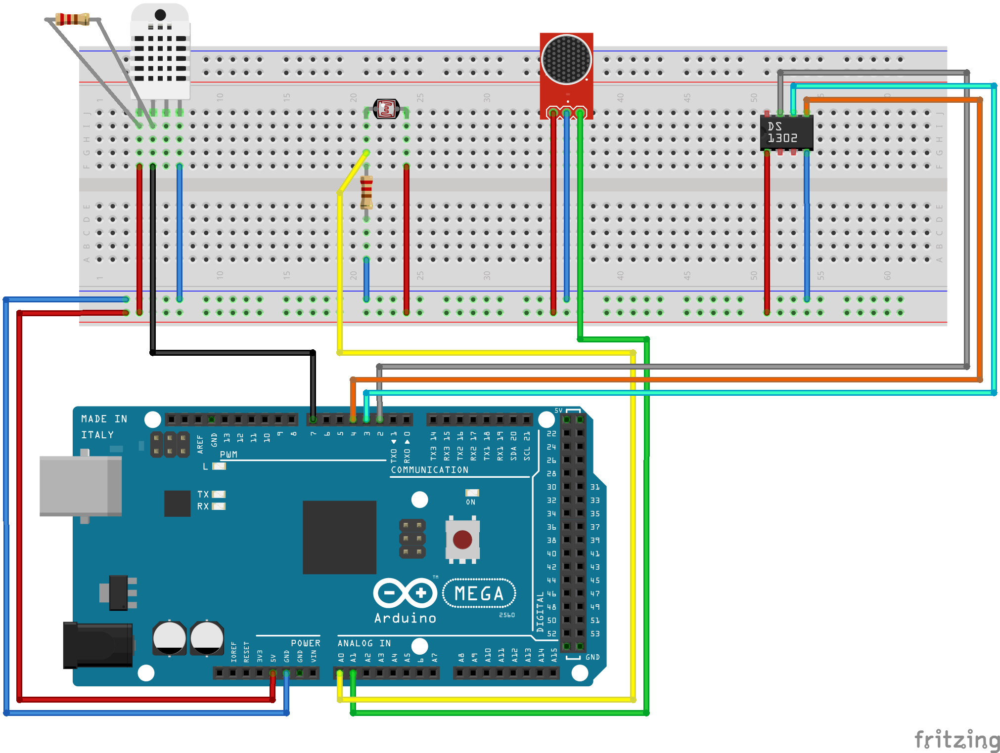

# Weather Station

## Overview
This project is a weather station built on Arduino Mega 2560 with a built-in ESP8266 . It collects environmental data such as temperature, humidity, brightness and noise levels and displays this information on a web server. The weather station updates in real-time and provides historical data for the past three days.

## Features
- **Real-Time Weather Data**: Displays the current time, weather conditions (e.g., sunny, cloudy), temperature, humidity, brightness, and noise levels.
- **Web Interface**: Hosts a web server to show weather data in a user-friendly HTML interface.
- **Historical Data**: Displays environmental data for the last three days in a tabular format.
- **Day/Night Mode**: Automatically adjusts functionality, hiding sky-related data at nighttime.

## Components Used
1. **Arduino Mega 2560 + WiFi (ESP8266)**
2. **DHT Sensor** (for temperature and humidity)
3. **LDR (Light-Dependent Resistor)** (for brightness measurement)
4. **Sound Sensor** (for noise level measurement)
5. **RTC Module** (Real-Time Clock for timekeeping)
6. **Breadboard and Connecting Wires**
7. **Power Supply**

## How It Works
1. The Arduino collects data from the connected sensors.
2. The ESP8266 module connects to a WiFi network and starts a web server.
3. The data is formatted into an HTML page and served via the web server.
4. Users can access the weather data by visiting the station's IP address on a browser.

## Installation
### Schematic

### Hardware Setup
1. Connect the sensors to the Arduino Mega according to the schematic.
2. Ensure the ESP8266 module is properly connected to Serial3.
3. Connect the RTC module for accurate time tracking.
4. Power the Arduino and sensors via USB or an external power source.

### Software Setup
1. Install the required libraries in the Arduino IDE:
   - 
   - 
   - 
2. Upload the `WeatherStation.ino` sketch to the Arduino Mega.
3. Modify the `ssid` and `pass` variables in the code to match your WiFi network credentials.

## Usage
1. Power on the system.
2. Wait for the ESP8266 to connect to the WiFi network.
3. Open the Serial Monitor to view the assigned IP address.
4. Enter the IP address in a web browser to access the weather station's data.

## Sample Output
### Real-Time Data
- **Time**: 12:30 PM
- **Condition**: Partly Cloudy
- **Temperature**: 25°C
- **Humidity**: 60%
- **Brightness**: 500 lux
- **Noise Level**: 30 dB

### Historical Data
| Date       | Temperature (°C) | Humidity (%) | Brightness (lux) | Noise (dB) |
|------------|----------------|-------------|----------------|-----------|
| 01-Jan-25 | 23            | 55          | 450            | 35        |
| 02-Jan-25 | 24            | 60          | 500            | 30        |
| 03-Jan-25 | 25            | 58          | 520            | 33        |

## Troubleshooting
- **No WiFi Connection**: Ensure the correct WiFi credentials are set and that the ESP8266 is properly wired.
- **No Data on Web Page**: Verify that the sensors are connected correctly and functioning.
- **RTC Issues**: Check that the RTC module has a working battery and is correctly initialized.

## Future Improvements
- Add support for additional sensors (e.g., pressure, CO2).
- Implement data logging to an SD card or cloud storage.
- Enhance the web interface with graphs and more customization options.
- Improve error handling and diagnostics.

## License
This project is licensed under the MIT License. See the [LICENSE](LICENSE) file for details.
